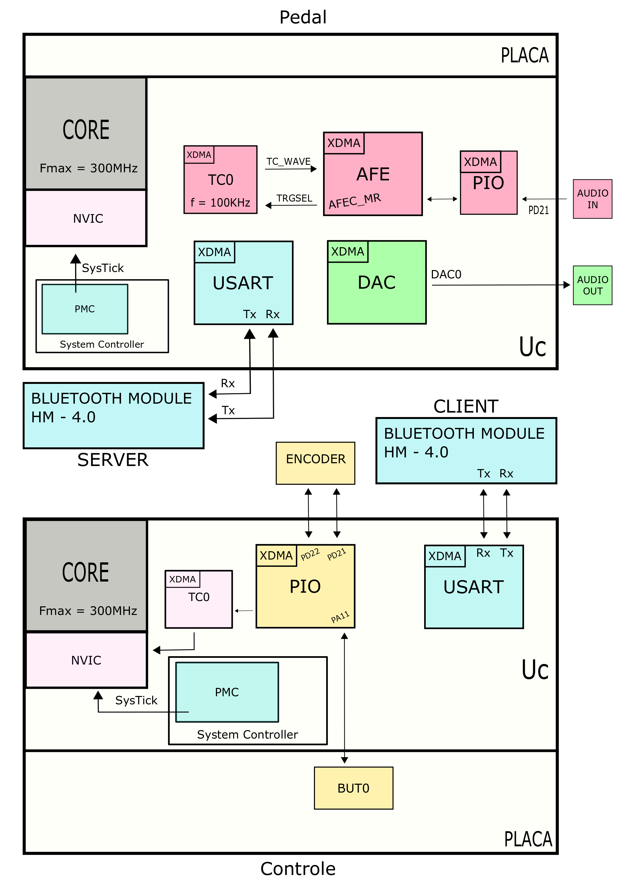

# Projeto Final Computação Embarcada

## Processamento de Sinais e Transmissão Bluetooth 4.0

### Sabrina Simão e Paulo Tozzo

 { width: 200px; }

## Descrição do Funcionamento

#### O repositório acima consta de 4 pastas diferentes. A primeira é a pura implementação do funcionamento do ADC e DAC, recebendo e processando sinais analogicos para digital e vice versa. Nesta pasta, você pode testar nosso projeto sem a camada de conectividade.

A segunda e terceira pasta são respectivas ao projeto final, onde há junção de leitura de sinais com implementação bluetooth e USART. A primeira pasta, chamada Cliente, é o código da placa que funciona como controle remoto, como visto no diagrama de blocos. O diretório chamado SERVER implementa a parte relativa ao pedal em si e faz a recepção dos dados transmitidos por Bluetooth.

Seguindo o esquema de conexão e montagem abaixo, você poderá controlar a distorção que entra no microcontrolador. O botão seleciona a distorção desejada (num total de 3, então toda vez que você apertar o botão ele seleciona a próxima, 0,1,2,0,1,2...) e o encoder altera a variável respectiva à distorção (volume, por exemplo).

